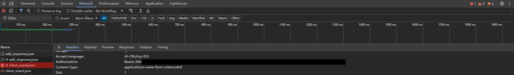
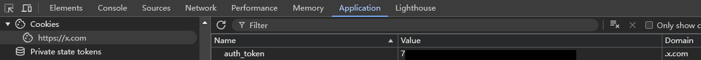

# Grok Free Web API for Vercel

[](https://vercel.com/new/clone?repository-url=https%3A%2F%2Fgithub.com%2Fomgpizzatnt%2Fgrok-free-web-api-vercel)

## Overview

This project provides an OpenAI-compatible API proxy for accessing Grok AI models through Vercel's serverless infrastructure. It allows you to interact with Grok models using the familiar OpenAI API format without any additional server setup.

## Features

- ✅ OpenAI API compatible interface
- ✅ Support for streaming and non-streaming responses
- ✅ Zero server management with Vercel deployment
- ✅ Multiple Grok model support
- ✅ Built-in test client for easy verification

## API Endpoints

- `/v1/models` - Get available models
- `/v1/chat/completions` - Chat completions API (OpenAI compatible)

## Available Models

- **grok-3** - Standard Grok model
- **grok-3t** - Grok model with reasoning capabilities
- **grok-3ds** - Grok model with deep search capabilities

## Authentication Setup

To use this API proxy, you need to obtain two tokens from Grok:

1. **Bearer Token**:
   - Navigate to grok.x.com
   - Open DevTools (Press F12)
   - Send any message
   - In Network tab, locate 'client_event.json' request
   - Copy the 'authorization' value from request headers as auth_bearer

   

2. **Auth Token**:
   - In DevTools, go to Application -> Cookies -> https://x.com
   - Find and copy the auth_token value

   

## API Key Format

Your API key should be formatted as: `auth_bearer,auth_token`

## Request Example

```http
POST /v1/chat/completions
Content-Type: application/json
Authorization: Bearer YOUR_BEARER_TOKEN,YOUR_AUTH_TOKEN

{
  "model": "grok-3",
  "messages": [
    {"role": "user", "content": "What are the key features of quantum computing?"}
  ],
  "stream": true
}
```

## Deploying to Vercel

1. Fork this repository
2. Connect to Vercel
3. Deploy with default settings
4. Use your Vercel URL as the API endpoint

## Testing Your Deployment

The project includes a built-in test client available at `/test-client`. Use this to verify your API setup is working correctly.

## Important Notes

- This project is optimized for Vercel deployment only
- The proxy simply forwards requests to Grok API and does not store any content
- API requires valid Grok tokens to function properly
- Rate limits may apply based on your Grok account limitations